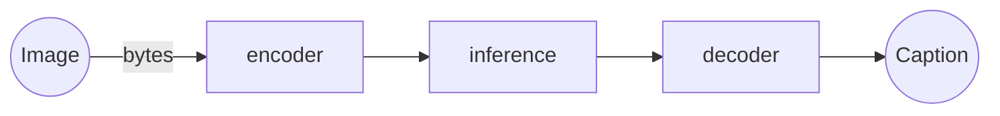
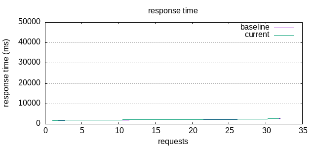
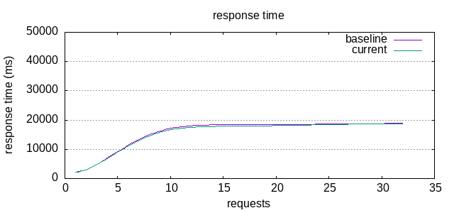
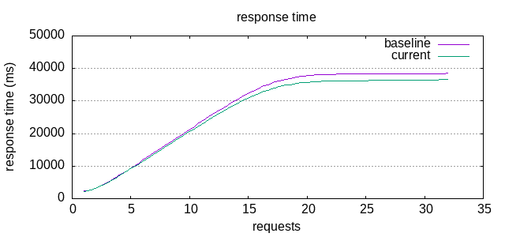

# Freepik Python Backend Challenge
Service that uses **GIT (short for GenerativeImage2Text) model** from [hugging face](https://huggingface.co/microsoft/git-base-textcaps) for image captioning.

## Service Requirements
The service must receive an imagen and returns a caption that describes the image.

It must be containerized in a Docker and run using `docker run`.
It must take advantage of all machine resources and provide concurrent
requests providing high performance and low response times.

The service can be exposed using **http** or **grpc**.

# Requirements

## git lfs
Install [git lfs](https://packagecloud.io/github/git-lfs/install) to clone the model repository.
It is required to clone the repository and download the model so that you don't have to download it every time.

### Ubuntu

```bash
curl -s https://packagecloud.io/install/repositories/github/git-lfs/script.deb.sh | sudo bash
sudo apt-get install git-lfs
```

Clone and download model:
```bash
make clone_repo
```

Clone the repository with the model
```bash
make clone_repo
```

# Usage

1. Build the docker:
```bash
make build
```

2. In one terminal run the server:

```bash
make run_docker
```

3. In other terminal make a request:
```bash
make test_server
```

The output should be something like this:
```bash
two cats sleeping on a couch with remotes on them.
total request time=1.763398
```

# Solution Design

I will use a **http interface** because I am more familiarized with it and a **tornado http server**
because is the fastest one (I usually use FastAPI).

The service receives and image and returns an string that represents the caption of the image.

To develop a high-performance service you have to work on several type of task:
* **I/O bound:** the requests that the server receives.
It must not be blocked while a request is being processed.
There are no other I/O bound tasks such as database or file accesses,
or request to other services at the beginning.
* **CPU bound:** Every code executed in Python.
Python only supports real concurrency creating new processes.
* **GPU bound:** model is implemented with PyTorch,
so the model is executed in the GPU.
It is convenient to create just one model
so that it makes all the inferences using some mini-batch mechanism. 



As we can see, the most heavy task is the inference one being 200 times slower
than the second slowest (encoder):
* **encoder:** 0.01
* **inference:** 1.93
* **decoder:** 0.0002

## Assumptions

The service must take as much as possible resources of the hosting machine.
However, some optimizations depends highly on the underline hardware.
So, I focused my effort in the optimization of the service for my machine.
It has the following specifications:

* **CPU:** Intel(R) Core(TM) i9-9980HK CPU @ 2.40GHz (8 cores, 16 threads)
* **RAM:** 64GB
* **GPU:** GeForce RTX 2080 Mobile (8192MiB)

## Benchmarks

To check the performance improvements (time responses),
I created a benchmarks with [Apache ab tool](https://httpd.apache.org/docs/2.4/programs/ab.html).
It is an Apache HTTP server benchmarking tool.
Plots are created using GNUPlot and a simple website display the results.

The command for running the benchmarks are `make baseline` that is run
at the beginning of the challenge, with the basic version of the service.
And `make benchmark` that is run for every improvement.

The benchmark is executed 3 times, with different level of concurrence (c),
1, 8, and 16 requests at time.
The total number of requests in each execution are 32.

Bellow you can see the results for the first version of
the service at different level of concurrency.
Each plot shows the time response of the 32 requests sorted by time response. 

*Response time (c=1)*



*Response time (c=8)*



*Response time (c=16)*



We can see how the service scale very bad because each requests is processed
one by one.

