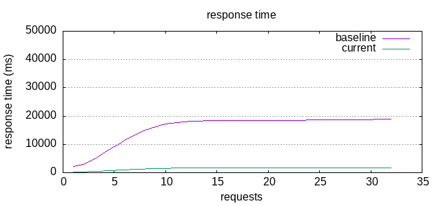

<!-- TOC -->
* [Freepik Python Backend Challenge](#freepik-python-backend-challenge)
  * [Service Requirements](#service-requirements)
* [Requirements](#requirements)
  * [Support CUDA from Docker](#support-cuda-from-docker)
  * [git lfs](#git-lfs)
    * [Ubuntu](#ubuntu)
* [Usage](#usage)
* [Solution Design](#solution-design)
  * [Assumptions](#assumptions)
  * [Benchmarks](#benchmarks)
* [GPU performance](#gpu-performance)
  * [Optimizations](#optimizations)
  * [GPU enabled in Docker](#gpu-enabled-in-docker)
  * [GPU Batch performance](#gpu-batch-performance)
* [GPU Batch Service](#gpu-batch-service)
  * [Results](#results)
* [Multi CPU and GPU Batch](#multi-cpu-and-gpu-batch)
  * [Results](#results-1)
* [Multi CPU](#multi-cpu)
* [Conclusion](#conclusion)
<!-- TOC -->

# Freepik Python Backend Challenge
Service that uses **GIT (short for GenerativeImage2Text) model** from [hugging face](https://huggingface.co/microsoft/git-base-textcaps) for image captioning.

## Service Requirements
The service must receive an imagen and returns a caption that describes the image.

It must be containerized in a Docker and run using `docker run`.
It must take advantage of all machine resources and provide concurrent
requests providing high performance and low response times.

The service can be exposed using **http** or **grpc**.

# Requirements

## Support CUDA from Docker

Source: https://saturncloud.io/blog/how-to-install-pytorch-on-the-gpu-with-docker/

Setup the package repository and the GPG key:

```bash
$ distribution=$(. /etc/os-release;echo  $ID$VERSION_ID)  
$ curl -s -L https://nvidia.github.io/nvidia-docker/gpgkey | sudo apt-key add -  
$ curl -s -L https://nvidia.github.io/nvidia-docker/$distribution/nvidia-docker.list | sudo tee /etc/apt/sources.list.d/nvidia-docker.list
```

Install the nvidia-container-toolkit package (and dependencies) after updating the package listing:

```bash
$ sudo apt-get update
$ sudo apt-get install -y nvidia-container-toolkit
```

Now, configure the Docker daemon to recognize the NVIDIA Container Runtime:

```bash
$ sudo nvidia-ctk runtime configure --runtime=docker
```

Restart the Docker daemon to complete the installation after setting the default runtime:

```bash
$ sudo systemctl restart docker
```

## git lfs
Install [git lfs](https://packagecloud.io/github/git-lfs/install) to clone the model repository.
It is required to clone the repository and download the model so that you don't have to download it every time.

### Ubuntu

```bash
$ curl -s https://packagecloud.io/install/repositories/github/git-lfs/script.deb.sh | sudo bash
$ sudo apt-get install git-lfs
```

Clone and download model:
```bash
$ make clone_repo
```

Clone the repository with the model
```bash
$ make clone_repo
```

# Usage

1. Build the docker:
```bash
$ make build
```

2. In one terminal run the server:

```bash
$ make run_docker
```

3. In other terminal make a request:
```bash
$ make test_server
```

The output should be something like this:
```bash
two cats sleeping on a couch with remotes on them.
total request time=1.763398
```

# Solution Design

I will use a **http interface** because I am more familiarized with it and a **tornado http server**
because is the fastest one (I usually use FastAPI).

The service receives and image and returns an string that represents the caption of the image.

To develop a high-performance service you have to work on several type of task:
* **I/O bound:** the requests that the server receives.
It must not be blocked while a request is being processed.
There are no other I/O bound tasks such as database or file accesses,
or request to other services at the beginning.
* **CPU bound:** Every code executed in Python.
Python only supports real concurrency creating new processes.
* **GPU bound:** model is implemented with PyTorch,
so the model is executed in the GPU.
It is convenient to create just one model
so that it makes all the inferences using some mini-batch mechanism. 


As we can see, the most heavy task is the inference one being 200 times slower
than the second slowest (encoder):
* **encoder:** 0.01
* **inference:** 1.93 (CPU), 0.625 (GPU)
* **decoder:** 0.0002

## Assumptions

The service must take as much as possible resources of the hosting machine.
However, some optimizations depends highly on the underline hardware.
So, I focused my effort in the optimization of the service for my machine.
It has the following specifications:

* **CPU:** Intel(R) Core(TM) i9-9980HK CPU @ 2.40GHz (8 cores, 16 threads)
* **RAM:** 64GB
* **GPU:** GeForce RTX 2080 Mobile (8192MiB)

## Benchmarks

To check the performance improvements (time responses),
I created a benchmarks with [Apache ab tool](https://httpd.apache.org/docs/2.4/programs/ab.html).
It is an Apache HTTP server benchmarking tool.
Plots are created using GNUPlot and a simple website display the results.

The command for running the benchmarks are `make baseline` that is run
at the beginning of the challenge, with the basic version of the service.
And `make benchmark` that is run for every improvement.

The benchmark is executed 3 times, with different level of concurrence (c),
1, 8, and 16 requests at time.
The total number of requests in each execution are 32.

Bellow you can see the results for the first version of
the service at different level of concurrency.
Each plot shows the time response of the 32 requests sorted by time response. 

*Response time (c=1)*


*Response time (c=8)*


*Response time (c=16)*


We can see how the service scale very bad because each requests is processed
one by one.

# GPU performance

## Optimizations
First I will try to optimize GPU inference.
I followed these recommendations: https://huggingface.co/docs/transformers/main/perf_infer_gpu_one
However, none of the optimizations are suitable for this custom model:

* Flash Attention 2.0: The current architecture does not support Flash Attention 2.0.
* FlashAttention: The model type git is not yet supported to be used with BetterTransformer.
* Optimum with ONNX Runtime: Problems trying to export the model,
it is a custom or unsupported architecture for
the task text-generation-with-past,
but no custom onnx configuration was passed as `custom_onnx_configs`.
It is too complex for the challenge trying to figure out how the configuration should be. 

## GPU enabled in Docker

Hopefully, making debugging I realised that the model was not using the GPU!

So, I tested a version using the GPU. The performance is much better! :-)

*Response time (c=1)*


*Response time (c=8)*



*Response time (c=16)*


Hereinafter, the GPU enabled version will be used as baseline.

## GPU Batch performance

Just to know how the performance works with the number of batches.

From 1 to 128, in steps of 16. At 128 the GPU is out of memory.
So, the test has been carry out up to 64.

The script for the test is in scripts/batch_performance.py. It
can be run using Makefile:

```bash
$ make batch_performance
```

As we can see in the plot, the batch execution scales better than sequential one:


# GPU Batch Service

A thread has been created that receives requests from a queue.
It accumulates the requests and response queues
while it receives requests within 1 millisecond.
When the timeout exception is raised or it has reached the maximum batch size (64),
it computes all the requests and returns the response to the corresponding queue.

## Results

To check the performance improvement the concurrence
and the number of request have been increased to 64 and 256, respectively.
Baseline has been rerun using the file `src/image_captions/baseline_app.py`.

As we can see, time response using batching is 50% faster than sequential one:

*Response time (c=64)*


It takes 10 seconds in inferring 64 images, it is 0.156 seconds per image.

# Multi CPU and GPU Batch

Another option is to create two types of services, one public and other private.
The public one launches one server per core but left one free for the private service. 
So, there are 15 processes running the public server and one the private one.
Tornado balances the requests among the 15 public services.
The public server receives the images and sent them to the private server asynchronously.

Because encoder takes some time (0.01 seconds),
it can be run in each server so that the private service receives the encoded
image, that is, a multidimensional array (1, 3, 224, 224).
Decoder task is really fast, so it can be achieved in the CPU
and only the encoded data are sent to the inference service.
The private service works like the previous version,
asynchronously and inferring in batch received from a queue.

Bellow, you can see a diagram of the tasks, each colour is executed in
a different proces (CPU).
A single process can send several requests to the inference services
as it did in the previous version.


Below, you can see a sequence diagram with just two public services.
Note that, they can process several request before receiving a response
because they are asynchronous, but it is not reflected in the diagram.


The idea is to increase the performance due to encoder task is achieved by the CPU.

## Results

Below, we can see that time responses for concurrency equal to 64.
Unfortunately, the performance is worse than the previous version
with one service.

*Response time (c=64)*


Is it much slower encoding images one by one in the CPU than in batches
in the GPU? The comparison generated with 
`scripts/gpu_batch_cpu_sequential_performance.py` shows
that the performance difference is small:


So, the overhead in redirecting the calls to the private service is too high.

# Multi CPU
Another option is to try making inference just with CPU.
As we can see, GPU Batch is not a big difference.
So, as we have 16 cores, maybe it could get a better performance.

However, inferring using CPU uses many cores. 
Before implementing the service, a performance test has been carried out.
Using a Pool of 2 process runs more than 20 times slower than GPU using batching.


So, this approach has been discarted.

# Conclusion

The best approach is [GPU Batch Service](#gpu-batch-service).

GPU is faster than CPU just processing an image,
but it is much faster processing multiple images.

The approach [Multi CPU and GPU Batch](#multi-cpu-and-gpu-batch)
was promissing but the overhead of HTTP request and serialization and
deserialization of the encoders is bigger than the benefit of using
multiple CPUs for encoding the image.